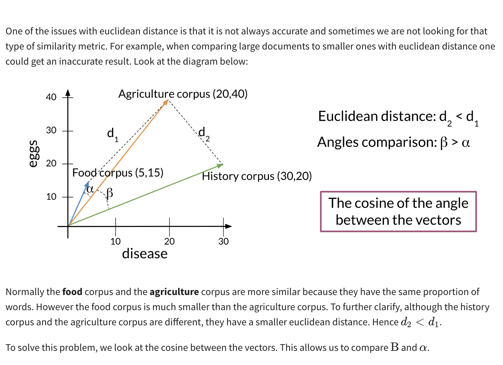

**Vector space**
    - Vector space is one of the important concept in NLP domain. It means to represent the words in numeric vectors with semantic information.
    - Simple numeric representation like Naive Bayes do not consider the semantic information about any word.
**word by word and word by document**:
    - these are technique to represent the word in numeric matrix which contain the information about how each word is close to other word.
    - The resultant matrix is also called co-occurence matrix.

**euclidean distance**:
    - By using column vector from co-occurence matrix we can find the euclidean distance b/w them.
    - It indicates how two close these vectors are in term of meaning.
    
    - It can fail it dataset is not normalize.
    
**Cosine similarity**
    - 